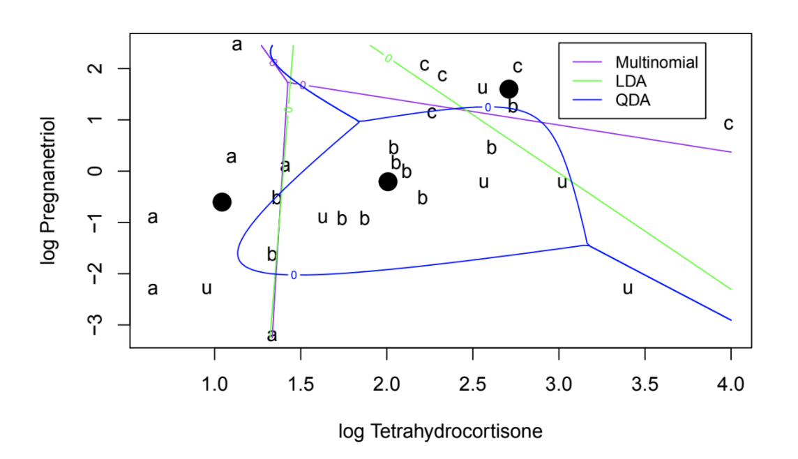

# Cushings

## Predicting Cushing’s Syndrome
For this project, I worked with the dataset Cushings in library MASS, which has data on three types of the disease Cushing’s syndrome and the levels fo two steroid metabolites used to diagnose the disease. I created three types models—Linear Discriminant Analysis, Quadratic Discriminant Analysis, and multinomial logistic regression to predict Cushing’s.

## Motivation
If left untreated, Cushing’s syndrome causes the pituitary gland to keep producing massive amounts of cortisol, leading to symptoms of obesity, high blood pressure, acne, increased risk for heart attack, and other side effects. It is critical to diagnose patients with the correct type of Cushing’s syndrome so they can receive the appropriate treatment. The three models in this project help to distinguish between the three types of the condition.

## Sample Code

```
# LDA model, Z.l
Z.l <- lda((Type ~ logTetrahydrocortisone + logPregnanetriol, data = Cf)
Z.l

# QDA model, Z.q
Z.q <- qda(Type ~ logTetrahydrocortisone + logPregnanetriol, data= = Cf)
Z.q

# Multinomial model, Z.m
Z.m <- multinom(Type ~ logTetrahydrocortisone + logPregnanetriol, data = Cf)
Z.m

# Contour plot comparing the performance of all three models
plot(Cf_u_included[,1], Cf_u_included[,2], type="n",xlab = "log Tetrahydrocortisone", ylab ="log Pregnanetriol")
text(Cf_u_included[,1], Cf_u_included[,2],labels=Cf_u_included$Type) 
contour(xp,yp,Z.p1m,levels=0,add=T,col="purple") # multinomial
contour(xp,yp,Z.p3m,levels=0,add=T,col="purple") #multinomial
contour(xp,yp,Z.p1l,levels=0,add=T,col="green") #lda
contour(xp,yp,Z.p3l,levels=0,add=T,col="green") #lda
contour(xp,yp,Z.p1q,levels=0,add=T,col="blue") #qda
contour(xp,yp,Z.p3q,levels=0,add=T,col="blue") #qda
legend(3,2.5, legend=c("Multinomial", "LDA", "QDA"), 
       col=c("purple", "green", "blue"), lty=1, cex=0.8)
points(meanA[1], meanA[2], pch=19, cex=2)
points(meanB[1], meanB[2], pch=19, cex=2)
points(meanC[1], meanC[2], pch=19, cex=2)
```

## Visualization


## Next Steps
With such a small dataset, these models lack predictive power; I would not confidently recommend that doctors use these models to diagnose Cushing's syndrome in patients beyond this sample. To expand on my work, I would like to retrain the LDA, QDA, and multinomial logistic regression models on a much larger data set for Cushing's patients with the goal of providing guidelines to help medical professionals distinguish between the three types of Cushing's syndrome.

## Collaborators
Alessandra Miranda, Williams College Class of 2020


